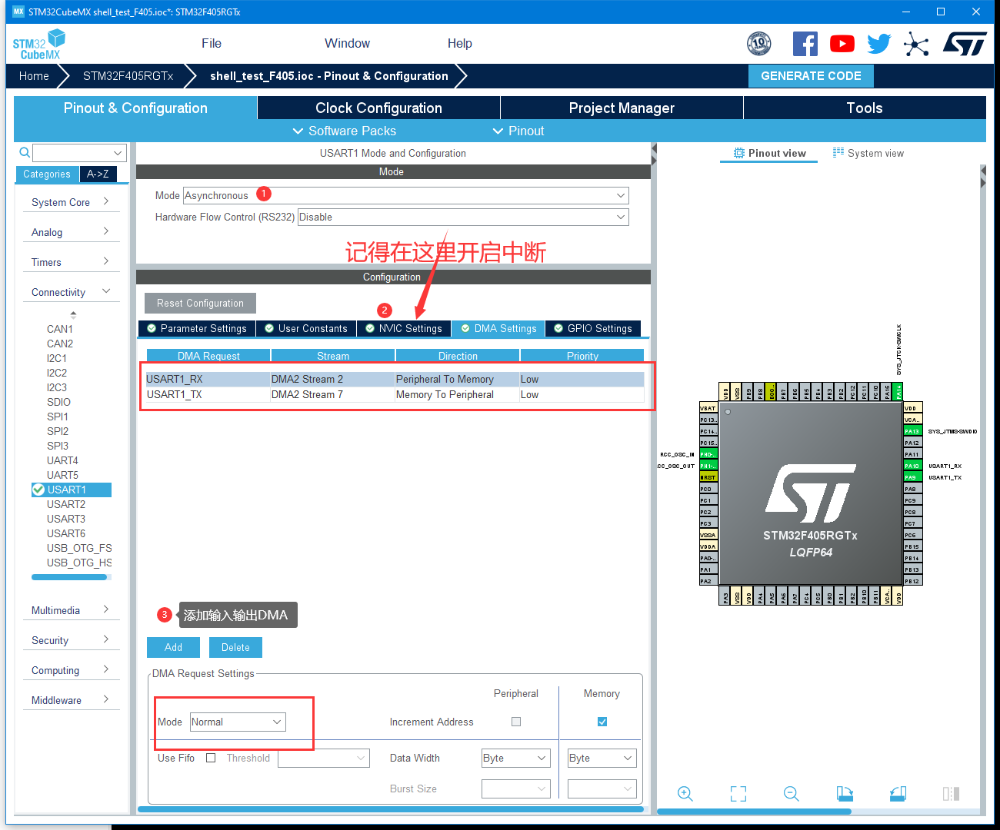
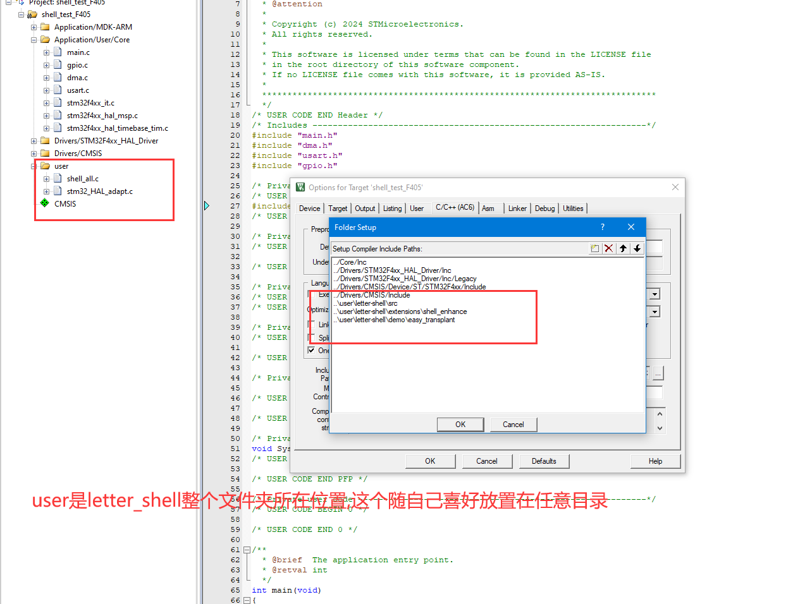
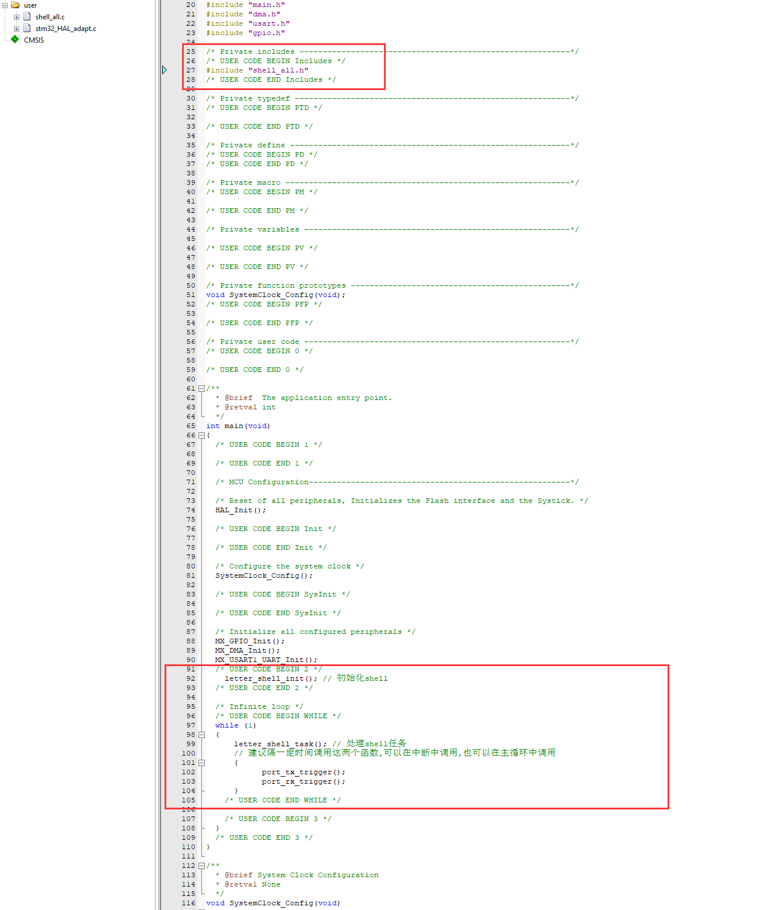
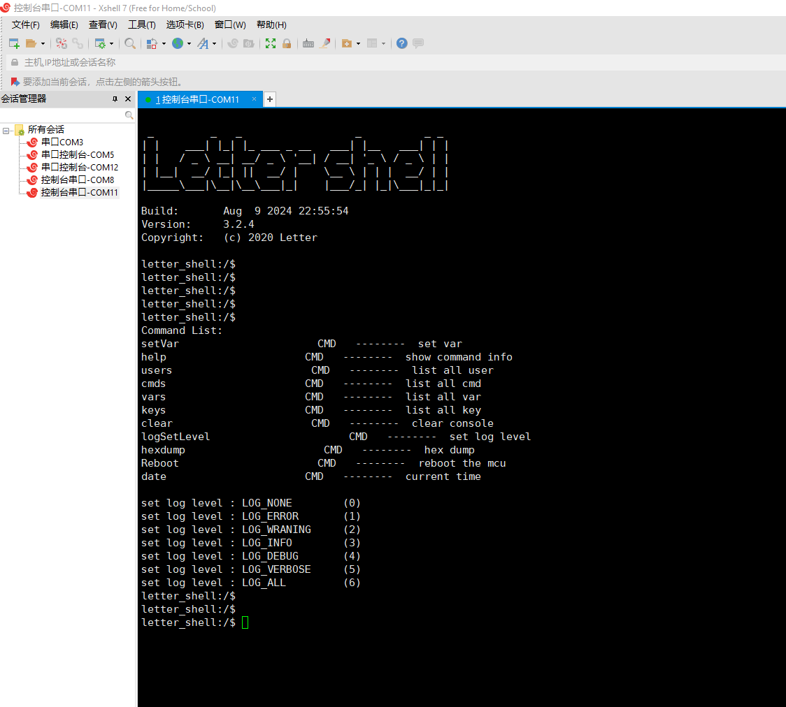

# easy_transplant demo

此目录文件为通用 letter-shell 移植的实例,目前仅提供了STM32 HAL库的适配文件

## 使用(以STM32 HAL库串口1 DMA适配为例)--AC6编译

在cubemx中开启串口,并且开启串口中断,添加串口的DMA发送和接收,DMA模式选择常规模式------其他时钟,调试接口之类的配置请自行配置

生成工程后打开

此处以keil为例

1. 将keil编译器切换为AC6,AC5太老了编译又慢,一定要选用AC5导致的编译报错请自行解决
2. 将此文件夹下shell_all.c和stm32_HAL_adapt文件夹下stm32_HAL_adapt.c添加编译
3. 将shell根目录下src文件夹和extensions/shell_enhance和shell_all.h所在文件夹添加头文件包含

在main.c中包含shell_all.h头文件,调用一次 `letter_shell_init`,轮询调用 `letter_shell_task`,轮询或定期调用 `port_tx_trigger`和 `port_rx_trigger`

OK,编译,烧录完事

# 其他移植可以参考stm32_HAL_adapt文件夹下实现

按照上诉方法进行移植也请看一下该文件夹下的实现,该实现下重写了STM32 HAL库的两个串口中断回调

# 其他说明

此例程移植同样力求不更改letter shell原仓库文件分布情况

shell对接最重要的在于read与write,通常是直接对接到外设上(例如串口),但是外设的速度是远低于内核的运行速度的,于是此例的移植对shell的输入输出都采用ringbuffer缓冲,这样方便解决在中断中调用shell读写(比如log组件)导致中断的的长时间运行,以及stm32_HAL_adapt中实现了支持FreeRTOS的情况下加锁之类的操作
