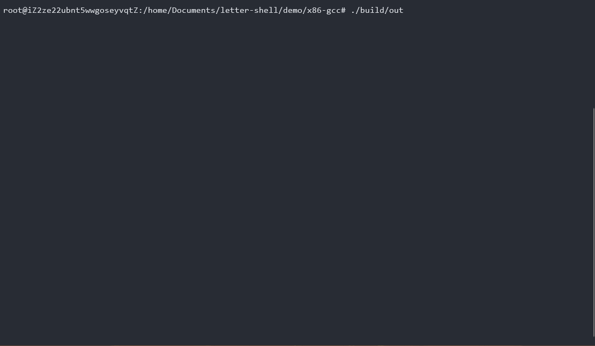

# letter shell file system support


letter shell文件系统支持



- [letter shell file system support](#letter-shell-file-system-support)
  - [简介](#简介)
  - [使用](#使用)

## 简介

fs_support作为letter shell的插件，用于实现letter shell对常见文件系统操作的支持，比如说cd，ls等命令，fs_support依赖于letter shell的伴生对象功能，并且使用到了内存分配和内存释放，所以请确认已经配置好了letter shell

fs_support并非一个完全实现的letter shell插件，由于文件系统的接口和操作系统以及具体使用的文件系统相关，所以fs_support仅仅通过接入几个基本的接口以实现`cd`，`ls`命令，具体使用时，可能需要根据使用的文件系统接口修改fs_support，letter shell的[demo/x86-gcc](demo/x86-gcc)下有针对linux平台的移植，可以及进行参考

## 使用

1. 声明`ShellFs`对象并申请当前路径数据缓冲区

    ```c
    ShellFs shellFs;
    char shellPathBuffer[512] = "/";
    ```

2. 实现`getcwd`，`chdir`，`listdir`函数

    根据文件系统不同，这些函数会有不同的实现，请根据具体使用的环境进行修改

3. 初始化`ShellFs`对象

    ```c
    shellFs.getcwd = getcwd;
    shellFs.chdir = chdir;
    shellFs.listdir = userShellListDir;
    shellFsInit(&shellFs, shellPathBuffer, 512);
    ```

4. 初始化`Shell`对象

    设置shell当前路径缓冲，初始化shell，并添加伴生对象

    ```C
    shellSetPath(&shell, shellPathBuffer);
    shellInit(&shell, shellBuffer, 512);
    shellCompanionAdd(&shell, SHELL_COMPANION_ID_FS, &shellFs);
    ```
