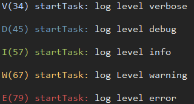

# log


嵌入式日志打印工具



- [log](#log)
  - [简介](#简介)
  - [使用](#使用)
  - [配置](#配置)
  - [API](#api)
    - [logPrintln](#logprintln)
    - [logError](#logerror)
    - [logWarning](#logwarning)
    - [logInfo](#loginfo)
    - [logDebug](#logdebug)
    - [logVerbose](#logverbose)
    - [logAssert](#logassert)
    - [logRegister](#logregister)
    - [logSetLevel](#logsetlevel)
    - [logHexDump](#loghexdump)
  - [结合letter shell尾行模式](#结合letter-shell尾行模式)
  - [其他用法](#其他用法)
    - [单独控制某个文件日志](#单独控制某个文件日志)

## 简介

log是一个用于嵌入式系统的日志打印工具，可以为日志定义不同的级别，然后设置日志工具的打印级别，可以进行日志打印的控制

此外，log通过letter shell的伴生对象功能，可以和letter shell结合，实现log和shell的绑定等功能

## 使用

1. 实现log写buffer函数

    ```C
    void uartLogWrite(char *buffer, short len)
    {
        serialTransmit(&debugSerial, (uint8_t *)buffer, len, 0x100);
    }
    ```

2. 定义log对象

    ```C
    Log uartLog = {
        .write = uartLogWrite,
        .active = true,
        .level = LOG_DEBUG
    };
    ```

3. 注册log对象

    ```C
    logRegister(&uartLog, NULL);
    ```

## 配置

通过修改log.h文件中的宏，可以对log工具进行配置

| 宏              | 意义                      |
| --------------- | ------------------------- |
| LOG_BUFFER_SIZE | log输出缓冲大小           |
| LOG_USING_COLOR | 是否使用颜色              |
| LOG_MAX_NUMBER  | 允许注册的最大log对象数量 |
| LOG_AUTO_TAG    | 是否自动添加TAG           |
| LOG_END         | log信息结尾               |
| LOG_TAG         | 自定添加的TAG             |
| LOG_TIME_STAMP  | 设置获取系统时间戳        |

## API

以下是log工具部分API的说明

### logPrintln

宏声明，用于一般的打印输出

```C
#define logPrintln(format, ...)
```

- 参数
  - `format` 输出格式
  - `...` 可变参数

### logError

宏声明，错误日志级别输出

```C
#define logError(fmt, ...)
```

- 参数
  - `fmt` 输出格式
  - `...` 可变参数

### logWarning

宏声明，警告日志级别输出，函数原型及参数说明参考`logError`

### logInfo

宏声明，信息日志级别输出，函数原型及参数说明参考`logError`

### logDebug

宏声明，调试日志级别输出，函数原型及参数说明参考`logError`

### logVerbose

宏声明，冗余日志级别输出，函数原型及参数说明参考`logError`

### logAssert

宏声明，断言

```C
#define logAssert(expr, action)
```

- 参数
  - `expr` 表达式
  - `action` 断言失败执行操作

### logRegister

注册log对象

```C
void logRegister(Log *log, Shell *shell)
```

- 参数
  - `log` log对象
  - `shell` 关联的shell对象

### logSetLevel

设置日志级别

```C
void logSetLevel(Log *log, LogLevel level)
```

- 参数
  - `log` log对象
  - `level` 日志级别

### logHexDump

数据16进制打印

```C
void logHexDump(Log *log, void *base, unsigned int length)
```

- 参数
  - `log` log对象
  - `base` 数据基址
  - `length` 数据长度

## 结合letter shell尾行模式

log工具可以结合letter shell的尾行模式，实现log和shell共用一个终端，但不影响shell交互体验

1. 使用`shellWriteEndLine`事项log写buffer函数

    ```C
    void uartLogWrite(char *buffer, short len)
    {
        if (uartLog.shell)
        {
            shellWriteEndLine(uartLog.shell, buffer, len);
        }
    }
    ```

2. 定义log对象

    ```C
    Log uartLog = {
        .write = uartLogWrite,
        .active = true,
        .level = LOG_DEBUG
    };
    ```

3. 注册log对象

    ```C
    logRegister(&uartLog, &shell);
    ```

## 其他用法

### 单独控制某个文件日志

log工具可以单独对某个文件的日志进行打印控制，使用时，在对应的.c文件中加入

```C
#undef  LOG_ENABLE
#define LOG_ENABLE  1
```

即可单独控制某个文件的日志开关
